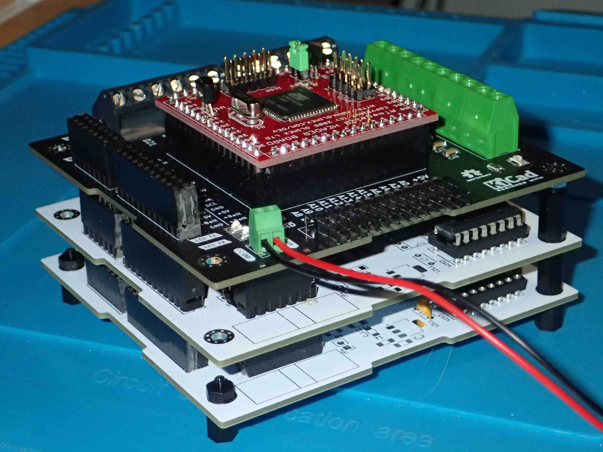
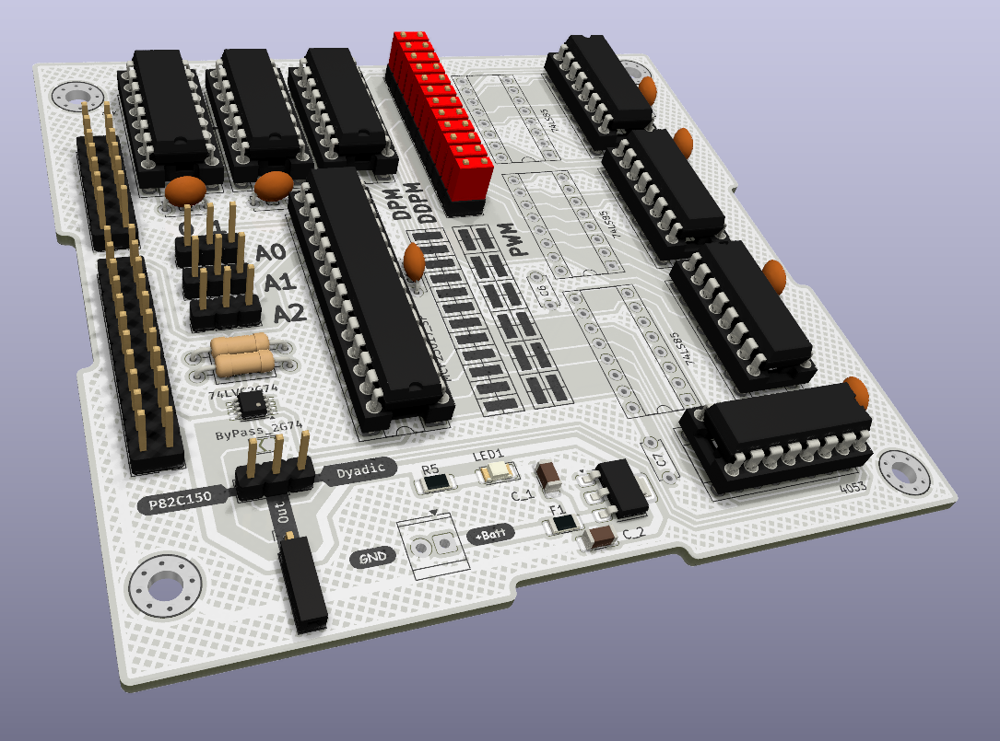

# DistributedPulseModulation

Distributed pulse modulation done like with the old P82C150, but with descrete components

## Theory of operation

With a regular Pulse Width Modulation (PWM), all the pulses are grouped in a same and unique pulse over the whole period.
On Distributed Pulse Modulation (DPM) and Dyadic Descrete Pulse Modulation (DDPM), the aim is to distribute all the "sub-pulses" throughout the whole period.

## Two advantages :
* spectrum with more high frequencies than PWM : easier filtering in case of A/D conversion
* as the pulse distribution is continuously evaluated : a threshold modification, before the period end, is taken into account without delay

### Old P82C150 for DPM implementation
[P82C150 - Application note](https://www.nxp.com/docs/en/application-note/AN94088.pdf)

[P82C150 datasheet](https://www.digchip.com/datasheets/parts/datasheet/364/P82C150AHT-pdf.php)

### DDPM implementation based on Paolo S. Crovetti thesis
[Thèse : Paolo S. Crovetti](https://www.researchgate.net/publication/309012492_All-Digital_High_Resolution_DA_Conversion_by_Dyadic_Digital_Pulse_Modulation)

## The breakout board

###  Features
	PWM (Pulse Width Modulation)
	DPM P82C150-like (Distributed Pulse Modulation)
	DDPM (Dyadic Discrete Pulse Modulation)

### Photographies done with the PCB_V1.0 board

### MCP23017 Port A & B

	MCP23017 is an I2C 16bits IO expander
	Port A & B are used to control the board
	Prescaler decoding values :
	0x00	1
	0x01	2
	0x02	8
	0x03	16
	0x04	64
	0x05	256
	0x06	1024
	0x07	4096

## Board configurations (PCB_V2.0)

### PWM

* do not populate the CD74HCT4053
* place the jumpers as describe in the silkscreen schematic (PWM)

### DPM

* do not populate the CD74HCT4053
* place the jumpers as describe in the silkscreen schematic (DPM/DDPM)

### DDPM

* do not populate the 74LS85
* place the jumpers as describe in the silkscreen schematic (DPM/DDPM)

