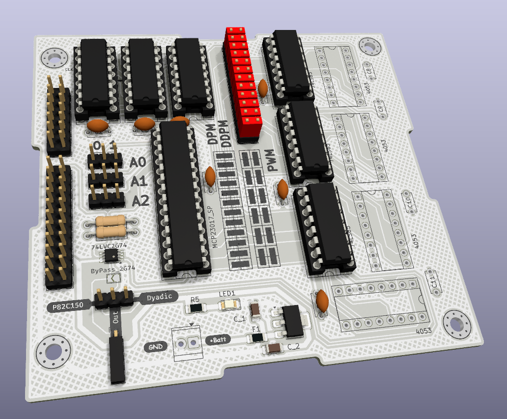

# DistributedPulseModulation

Distributed pulse modulation done like with the old P82C150, but with descrete components

## "Theory of operation"

Au lieu de grouper tous les pulse de fançon contigüe comme en PWM, le principe est de les distribuer le plus uniformément possible sur a période du compteur.

### Sur la base du P82C150

### Sur la base de la thèse de Paolo S. Crovetti

## La carte de développement

Permet de faire :
- PWM (Pulse Width Modulation)
- DPM façon P82C150 (Distributed Pulse Modulation)
- DDPM (Dyadic Discrete Pulse Modulation)

### PWM

- ne pas monter les ADG333A
- positionner les jumpers comme dans le schéma (PWM/DDPM) sérigraphié sur le PCB

### DPM

- ne pas monter les ADG333A
- positionner les jumpers comme dans le schéma (DPM) sérigraphié sur le PCB

### DDPM

- ne pas monter les 74LS85
- positionner les jumpers comme dans le schéma (PWM/DDPM) sérigraphié sur le PCB
